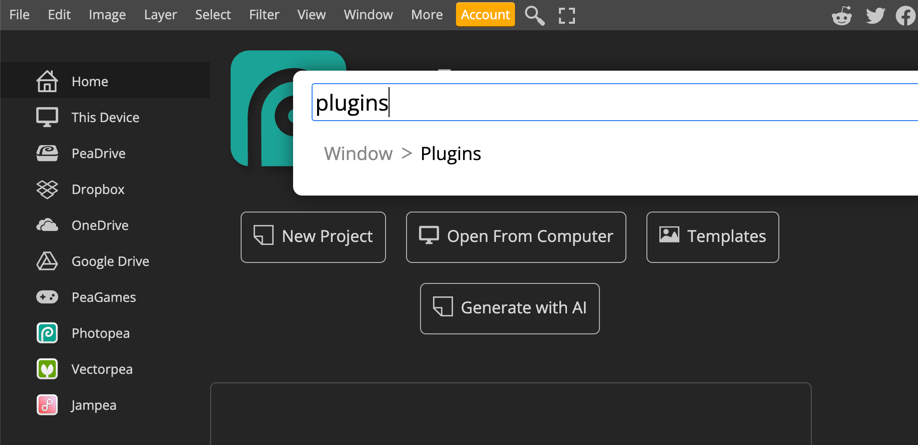
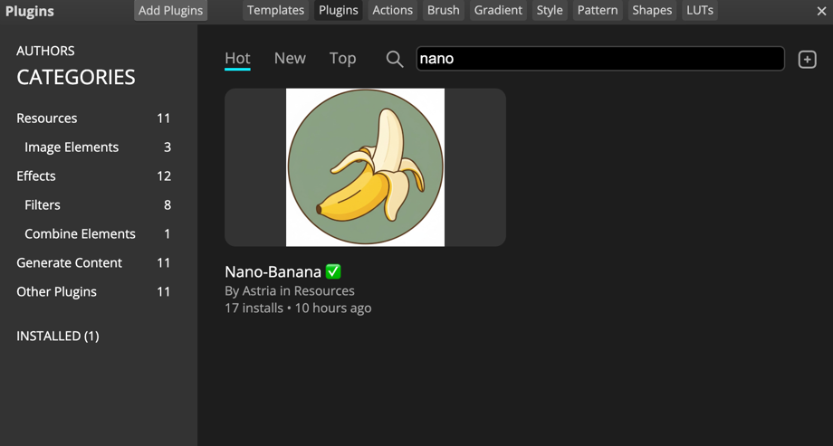
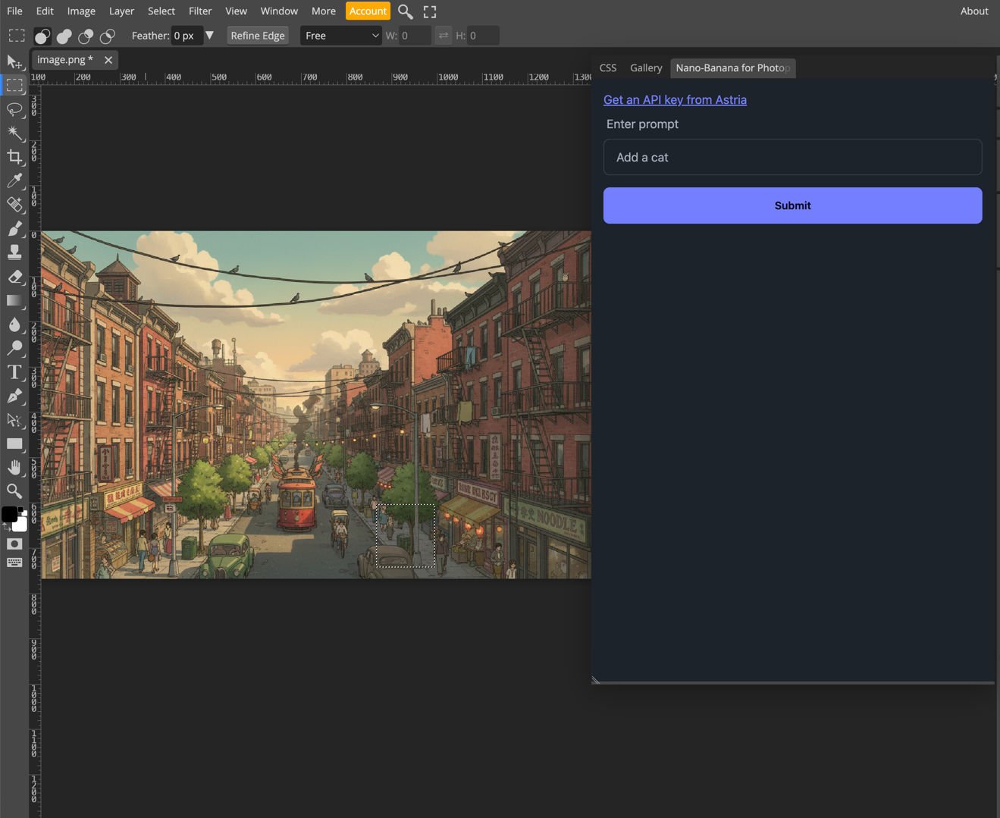

# Photopea Plugin for Nano-Banana

## Install
1. Open [Photopea](https://www.photopea.com/)
2. Using the Search tool in Photopea - search for "Plugins" 
    
2. Search for "Nano-Banana" plugin by Astria
   
3. Click to install
4. Now the plugin is installed

## Using the plugin in Photopea
1. Select an area using the select tool
    
2. Open the plugin, write a prompt and click generate
3. The plugin will generate an image and paste it as a new layer

# Development:
1. Launch (see instructions to create SSL cert in server.py)
```shell
python3 server.py
```
2. Open [Photopea with custom environment](https://www.photopea.com#%7B%22files%22%3A%5B%22https%3A%2F%2Fmp.astria.ai%2Ftzpai1h8cvjmgyd1o4ox79h7rthz%22%5D%2C%22environment%22%3A%7B%22plugins%22%3A%5B%7B%22name%22%3A%22Nano-Banana%20for%20Photopea%22%2C%22description%22%3A%22Selection-based%20AI%20image%20generation%20(Nano-Banana)%22%2C%22url%22%3A%22https%3A%2F%2Flocalhost%3A4443%2F%22%2C%22icon%22%3A%22https%3A%2F%2Flocalhost%3A4443%2Ficon.jpeg%22%7D%5D%7D%7D).
    
    This url was created using [Photopea Playground](https://www.photopea.com/api/playground)

