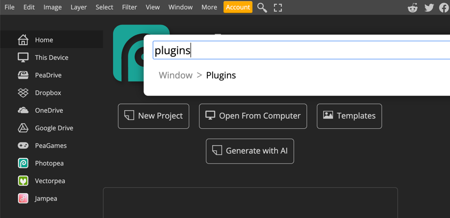
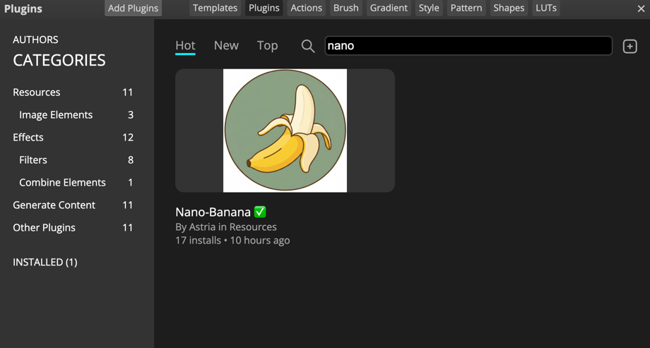
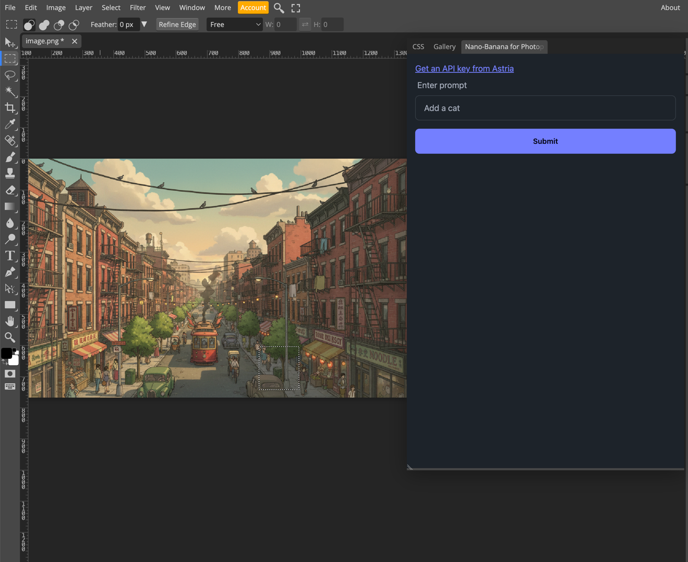

# Photopea Plugin for Nano-Banana

[See tutorial on Youtube](https://www.youtube.com/watch?v=gvvw0sPsv20)
[](https://www.youtube.com/watch?v=gvvw0sPsv20)

## Install
1. Open [Photopea](https://www.photopea.com/)
2. Using the Search tool in Photopea - search for "Plugins" 
    
2. Search for "Nano-Banana" plugin by Astria
   
3. Click to install
4. Now the plugin is installed

## Using the plugin in Photopea
1. Select an area using the select tool
    
2. Open the plugin, write a prompt and click generate
3. The plugin will generate an image and paste it as a new layer

# Development

The plugin is a React/TypeScript app under `plugin/`, built into `index.html`
and `assets/` at the repository root, which GitHub Pages serves at the
installed plugin URL. See [docs/photopea-plugin.md](docs/photopea-plugin.md)
for the architecture, the Photopea scripting findings, the validation record
and the open decisions.

```shell
npm install
npm run dev            # https://localhost:4443 (self-signed server.pem, see below)
npm run test           # vitest
npm run build          # rebuilds index.html and assets/; commit them to publish
npm run build:preview  # the same build under next/, for a side-by-side preview
```

The dev server proxies the API on its own origin, so it works from any local
port. Open `?fixture=1&mock=1` for UI work without Photopea or the API, or
`?host=embed&mock=1` to drive a real Photopea in a side frame. To load the dev
build inside Photopea's own plugin panel, first open https://localhost:4443/
once and accept the certificate, then open
[Photopea with the dev plugin](https://www.photopea.com#%7B%22files%22%3A%5B%22https%3A%2F%2Fmp.astria.ai%2Ftzpai1h8cvjmgyd1o4ox79h7rthz%22%5D%2C%22environment%22%3A%7B%22plugins%22%3A%5B%7B%22name%22%3A%22Nano-Banana%20for%20Photopea%22%2C%22description%22%3A%22Selection-based%20AI%20image%20generation%20(Nano-Banana)%22%2C%22url%22%3A%22https%3A%2F%2Flocalhost%3A4443%2F%22%2C%22icon%22%3A%22https%3A%2F%2Flocalhost%3A4443%2Ficon.jpeg%22%7D%5D%7D%7D)
(`environment.dev.json`, encoded with the
[Photopea playground](https://www.photopea.com/api/playground)).

The certificate: `openssl req -new -x509 -keyout server.pem -out server.pem -days 365 -nodes -subj "/CN=localhost"`.

